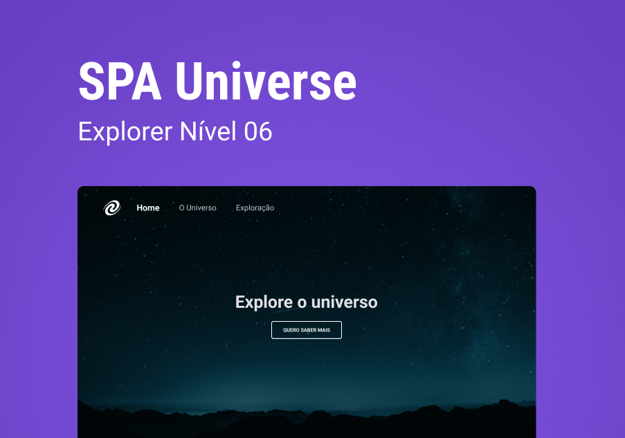

  

## 💻 Projeto

O SPA Universe é um projeto baseado em técnicas de SPA, utilizando HTML, CSS e Javascript puro.

## 🚀 Tecnologias

Esse projeto foi desenvolvido com as seguintes tecnologias:

- HTML
- CSS
- Javascript
- Git e Github

## 🏷️ Layout

Você pode visualizar o layout do projeto através
[desse link](<https://www.figma.com/file/AxLBlD5PorStydDJPvXBd0/%5BDesafios-Explorer%5D-SPA-Universe-(Copy)?type=design&node-id=104%3A48&mode=dev>)
É necessário ter uma conta no [Figma](https://www.figma.com)

Desenvolvido por [Gabriel George 👨🏻‍💻](https://www.linkedin.com/in/gabrielgeorgesilva/)